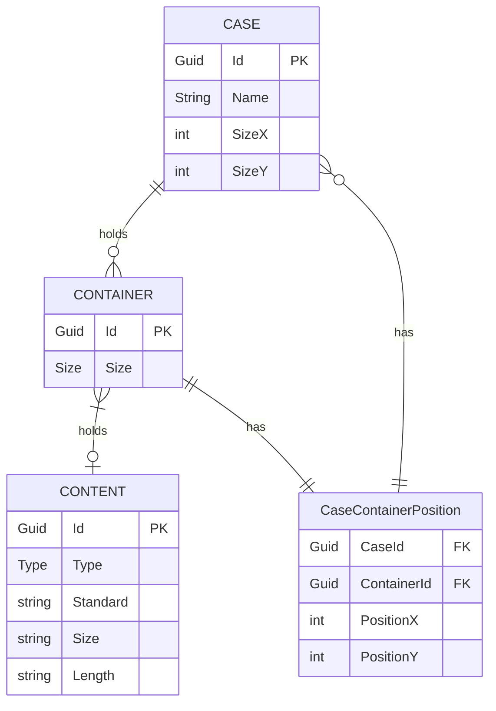

# ERD

```mermaid
erDiagram
    CASE ||--o{ CONTAINER : holds
    CONTAINER }|--o| CONTENT : holds

    CASE }o--|| CaseContainerPosition : has
    CONTAINER || -- || CaseContainerPosition : has

    CASE {
        Guid Id PK
        String Name
        int SizeX
        int SizeY
    }

    CONTAINER {
        Guid Id PK
        Size Size
    }

    CONTENT {
        Guid Id PK
        Type Type
        string Standard
        string Size
        string Length
    }

    CaseContainerPosition {
        Guid CaseId FK
        Guid ContainerId FK
        int PositionX
        int PositionY
    }
```